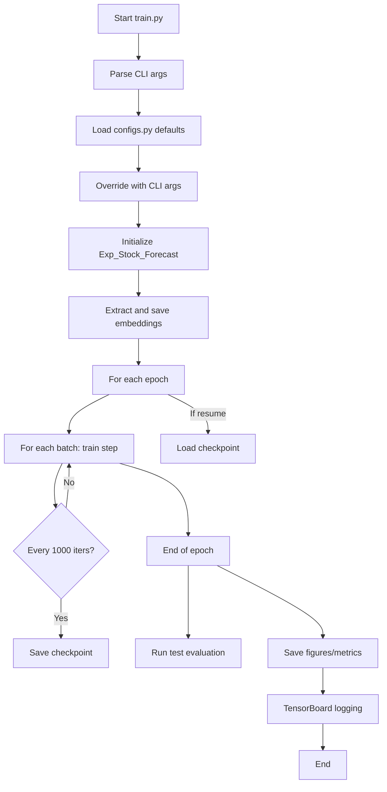

# Stock Market Forecasting with iTransformer

This project implements a specialized version of the iTransformer architecture for stock market price prediction, based on the paper ["iTransformer: Inverted Transformers Are Effective for Time Series Forecasting"](https://arxiv.org/abs/2310.06625).

## Overview

The iTransformer architecture inverts the traditional Transformer by treating features as the sequence dimension and timestamps as the feature dimension. This inversion is particularly effective for time series forecasting tasks, including stock market prediction.

## Project Structure

```
├── data_provider/      # Data loading and preprocessing
├── layers/             # Core transformer layers
├── models/             # Model architecture
├── utils/              # Utility functions
├── figures/            # Generated visualizations
├── checkpoints/        # Model checkpoints
├── logs/               # Logs and TensorBoard event files
├── embeddings/         # Saved embeddings
```

## Training and Experiment Management

All training and experiment management is performed via the command-line interface (CLI) using `train.py`. All configuration parameters can be set via CLI arguments, which override defaults in `configs.py`.

### Example Usage

```bash
python train.py --train_epochs 10 --batch_size 128 --resume_checkpoint checkpoints/exp1_epoch5.pth
```

### Major CLI Arguments

All fields in `StockPredictionConfig` (see `configs.py`) are available as CLI arguments. Key arguments include:

- **Data and Features**
  - `--data_dir`: Path to dataset directory
  - `--stocks`: List of stock tickers to use (JSON string)
  - `--features`: List of features (default: ["volume", "close", "transactions"])
  - `--train_size`, `--test_size`, `--val_size`: Number of files for each split

- **Sequence and Model**
  - `--seq_len`: Input sequence length (default: 60)
  - `--pred_len`: Prediction length (default: 15)
  - `--label_len`: Label length for teacher forcing
  - `--model`: Model type (default: "iTransformer")
  - `--d_model`, `--n_heads`, `--e_layers`, `--d_ff`, `--dropout`, etc.

- **Training**
  - `--batch_size`
  - `--learning_rate`
  - `--train_epochs`
  - `--patience`: Early stopping patience
  - `--max_train_iterations`: Limit iterations per epoch

- **Loss**
  - `--loss_type`: Loss function type
  - `--loss_kwargs`: Loss function parameters (JSON string)

- **Device**
  - `--use_gpu`, `--use_multi_gpu`, `--device_ids`

- **Special CLI-only Arguments**
  - `--resume_checkpoint`: Resume training from a specific checkpoint
  - `--quick_test`: Run a quick test (1 epoch, 10 iterations, minimal data)
  - `--extract_embeddings_only`: Only extract and save embeddings from the first batch, then exit
  - `--seed`: Random seed

**Note:** CLI arguments override all defaults in `configs.py`. Use `--help` for a full list of options.

## Experiment Outputs

All experiment outputs are organized by experiment/setting and saved to dedicated directories:

- **Checkpoints** (`checkpoints/`):  
  Model checkpoints are saved every 1000 iterations and at the best epoch (early stopping). Checkpoints include model state, optimizer state, and training progress. Training can be resumed from any checkpoint using `--resume_checkpoint`.

- **Logs** (`logs/`):  
  Training and evaluation logs, including TensorBoard event files for metrics, losses, and learning rates. Use TensorBoard to visualize training progress:
  ```bash
  tensorboard --logdir logs/
  ```

- **Figures** (`figures/`):  
  Training, validation, and test figures (e.g., learning curves, sample predictions) are saved at the end of each epoch.

- **Embeddings** (`embeddings/`):  
  Embeddings are always extracted and saved from the first batch before training starts.

## Workflow



## Memory-Efficient Data Loading

- Only one CSV file is loaded at a time per ticker for training, minimizing memory usage.
- User can control which files and tickers to use via CLI/config.
- Enables training on large datasets without high memory requirements.
- Sequences are created using a sliding window approach, and batches may mix sequences from different stocks and files.

## Data Preparation (Summary)

- **Input Features:** Volume, Close price, Number of transactions (normalized using global mean/std from training files).
- **Splitting:** Files are sorted chronologically and split into train/val/test sets.
- **Sequence Creation:** Each stock's data is split into sequences using sliding windows; only stocks with sufficient data are included.

## Obsolete Workflows

All previous workflows using `test_run.py` or manual script-based testing are obsolete. All experiment management, including quick tests, is now handled via CLI arguments in `train.py`.
