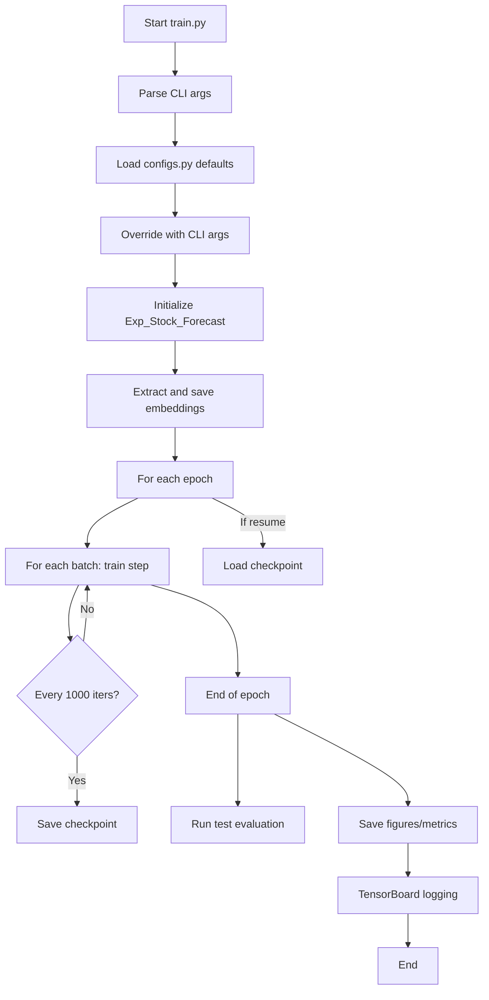

# Inverted Transformers Refactor Plan

## Overview

This plan outlines the refactor of the "Inverted Transformers" codebase to improve usability, efficiency, and standardization for machine learning experimentation on market data.

## Key Requirements

1. **Command-Line Interface & Config Integration**
   - All relevant parameters (e.g., number of samples, datasets, iterations, etc.) are settable via CLI.
   - CLI arguments override defaults in `configs.py`.
   - Remove `test_run.py`; all its functionality is available via CLI in `train.py`.

2. **Standardized Output**
   - Use TensorBoard for logging metrics, losses, and learning rates.
   - Continue to use `tqdm` for progress bars.
   - Save training/validation curves and other figures at the end of each epoch.

3. **Checkpointing & Resuming**
   - Save model checkpoints every 1000 iterations (in addition to best model via early stopping).
   - Allow resuming training from a specified checkpoint via CLI.
   - Organize checkpoints and logs by experiment/setting.

4. **Periodic Testing**
   - Run test evaluation at the end of every epoch.
   - Save test results and figures for later analysis.

5. **Embedding Extraction**
   - Always extract and save embeddings at the start of training (before the first epoch).

6. **Data Loading**
   - Only one CSV is loaded at a time, per ticker, for training (handled by `StockDataset`).
   - CLI/config options to control which tickers/files to use.

7. **GPU Utilization**
   - Profile and optimize batch size and data pipeline for better GPU usage.
   - Ensure all tensors are moved to the correct device.

8. **Training Window Logic**
   - 60 datapoints (1 hour) to predict the next 15 minutes (configurable via CLI/config).
   - Document and clarify this logic.

9. **Defaults & Usability**
   - Default epochs set to 1.
   - Clear CLI help and documentation.
   - All outputs (checkpoints, figures, logs) organized by experiment/setting.

---

## Updated Workflow (Mermaid Diagram)

---

## Implementation Notes

- **TensorBoard Integration:**  
  - Use `torch.utils.tensorboard.SummaryWriter` for logging losses, metrics, and learning rates.
  - Log at every batch and epoch as appropriate.

- **Checkpointing:**  
  - Save model state_dict, optimizer state, and epoch/iteration counters every 1000 iterations.
  - Allow `--resume_checkpoint` CLI argument to resume from a specific checkpoint.

- **Testing:**  
  - Run `exp.test()` at the end of every epoch, log results and figures.

- **Embeddings:**  
  - Always extract and save embeddings from the first batch before training starts.

---

## Open Questions (for future iterations)

- Should checkpointing interval (1000) be configurable via CLI?
- Should TensorBoard logs be kept for all experiments or pruned periodically?

---